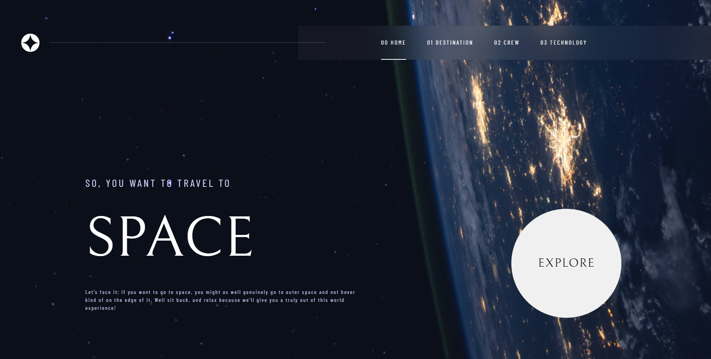
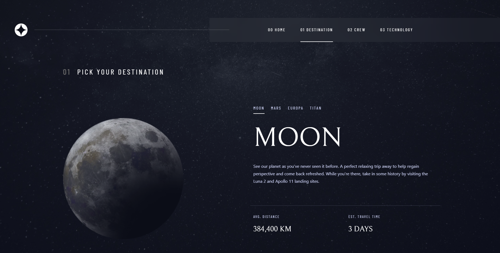
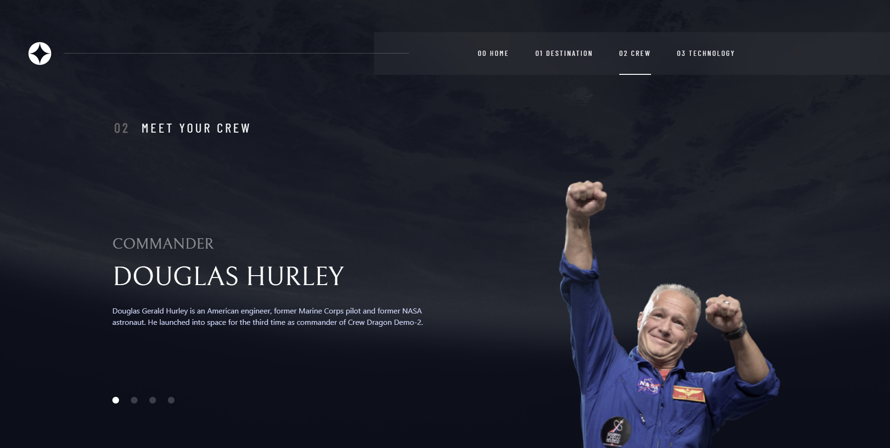
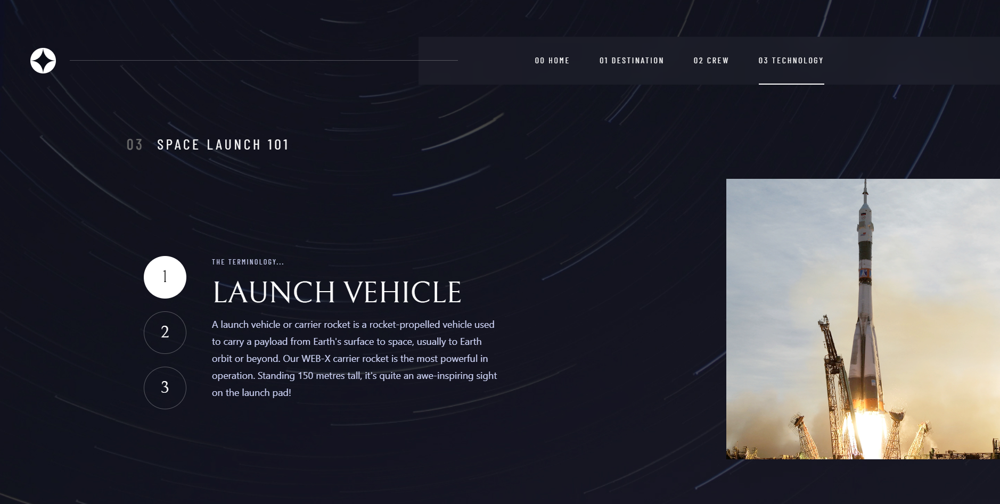
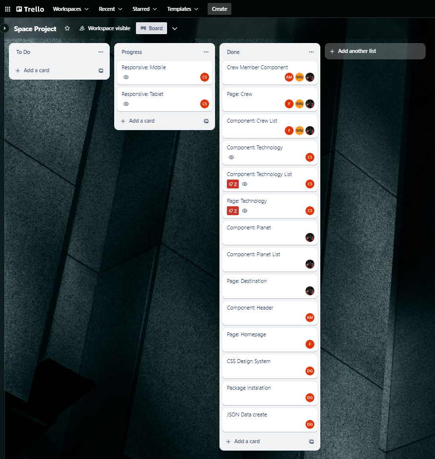

# Frontend Mentor - Space tourism website solution 

This is a solution to the [Space tourism website challenge on Frontend Mentor](https://www.frontendmentor.io/challenges/space-tourism-multipage-website-gRWj1URZ3). Frontend Mentor challenges help you improve your coding skills by building realistic projects. 

## Table of contents

- [Overview](#overview)
  - [The challenge](#the-challenge)
  - [Screenshot](#screenshot)
  - [Links](#links)
- [My process](#my-process)
  - [Built with](#built-with)
  - [What I learned](#what-i-learned)
- [Author](#author)
- [Acknowledgments](#acknowledgments)

## Overview

## The challenge

Users should be able to:

- View the optimal layout for each of the website's pages depending on their device's screen size
- See hover states for all interactive elements on the page
- View each page and be able to toggle between the tabs to see new information

## Screenshot






## Links

- Solution URL: [Github](https://github.com/dumi99/app7-space-tourism)
- Live Site URL: [Demo](https://app7-space-tourism.vercel.app/)

## The process

## Built with

- HTML5
- CSS 
- Flexbox
- Bootstrap
- [React](https://reactjs.org/) - JS library
- [React Router](https://reactrouter.com/en/main)

## What I learned

During the course of this project, I gained valuable insights and learned several essential skills:

1. **React Router**: I successfully implemented React Router to manage multi-page navigation in a React application. This allowed me to create a seamless user experience with different pages for home, destinations, crew, and technology, enhancing the website's overall functionality.

```js

import "./App.css";
import { createBrowserRouter, RouterProvider } from "react-router-dom";
import Homepage from "./Page/Homepage";
import Header from "./Components/Header/Header";
import Destination from "./Page/Destination";
import Technology from "./Page/Technology";
import Crew from "./Page/Crew";

const router = createBrowserRouter([
  {
    path: "/",
    element: <Homepage />,
  },
  {
    path: "/destination",
    element: <Destination />,
  },
  {
    path: "/technology",
    element: <Technology />,
  },
  {
    path: "/crew",
    element: <Crew />,
  },
]);

function App() {
  return (
    <>
      <Header />
      <RouterProvider router={router} />
    </>
  );
}

export default App;

```

2. **React Hooks (useState and useEffect)**: I delved into the world of React Hooks, specifically `useState` and `useEffect`. These essential hooks played a significant role in managing state and side effects in my application. Through practice and experimentation, I gained a solid understanding of how to use them efficiently.

```js

	const [selected, setSelected] = useState(0);
	const [techData, setTechData] = useState({});

	const handleSelected = (index) => {
		setSelected(index);
	};

	useEffect(() => {
		data.technology.forEach((item, index) => {
			if (selected === index) {
				setTechData(item);
			}
		});
	}, [selected]);

```

3. **Project Management with Trello**: Working in a team on this project, we utilized project management tools like Trello to plan and organize our tasks. This experience simulated real-world project management, helping us coordinate efforts and meet project milestones effectively.


These newfound skills not only helped me complete the space tourism website project but also expanded my knowledge and capabilities in web development and project management. I look forward to applying these skills to future projects and enhancing my proficiency as a developer.

## Authors

### Dumitrache George - Mentor

- LinkedIn - [George Dumitrache](https://www.linkedin.com/in/george-dumitrache-1021b120b/)
- Github - [dumi99](https://github.com/dumi99)

### Gava Marian - Trainee

- LinkedIn - [Gava Marian](https://www.linkedin.com/in/gava-marian-551034285/)
- Github - [GavaMG](https://github.com/GavaMG)

### Andrei Morosan - Trainee

- LinkedIn - [Andrei Morosan](https://www.linkedin.com/in/andrei-morosan-3463a6159/)
- Github - [AndreiMorosanC](https://github.com/AndreiMorosanC)

### Flavius - Trainee

- Github - [FlaVius1205](https://github.com/FlaVius1205)

### Szidelo Claudiu - Trainee

- LinkedIn - [Claudiu Szidelo](https://www.linkedin.com/in/claudiu-szidelo-671b1324a/)
- Github - [Szidelo](https://github.com/Szidelo)
- Frontend Mentor - [@Szidelo](https://www.frontendmentor.io/profile/Szidelo)

## Acknowledgments

We would like to express our gratitude to **Dumitrache George**,  our mentor, who provided valuable guidance and advice throughout the project.